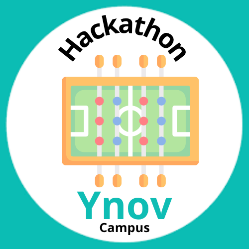

<table width="100%" border="0" cellspacing="0" cellpadding="0">
<tr>
<td align="left"><h1>Hackathon - Ynov Toulouse 2025</h1></td>
<td align="right"></td>
</tr>
</table>

> Ce repository contient les ressources ainsi que le code source développé lors du hackathon Ynov Toulouse 2025.

Cette template de README est un guide pour vous aider à structurer votre rendu de projet. N'hésitez pas à l'adapter ou surtout à le compléter avec des sections supplémentaires si nécessaire.

## Contexte

Et si on réinventait l’expérience babyfoot à Ynov ? L’objectif de ce hackathon est de moderniser et digitaliser l’usage des babyfoots présents dans le Souk pour créer un service _next-gen_, pensé pour près de 1000 étudiants !

Que ce soit via des gadgets connectés, un système de réservation intelligent, des statistiques en temps réel ou des fonctionnalités robustes pour une utilisation massive, nous cherchons des solutions innovantes qui allient créativité et technologie.

Toutes les filières sont invitées à contribuer : Dev, Data, Infra, IoT, Systèmes embarqués… chaque idée compte pour rendre le babyfoot plus fun, plus pratique et plus connecté.

Votre mission : transformer le babyfoot classique en expérience high-tech pour Ynov !

Bienvenue dans le Hackathon Ynov Toulouse 2025 !

> Retrouvez vos guidelines techniques dans le fichier [SPECIFICATIONS.md](./SPECIFICATIONS.md).

> P.S C'est un projet de groupe, pas autant de sous-projets que de filières dans votre équipe. Travaillez ensemble pour un seul et même projet au nom de votre équipe toute entière. Les guidelines sont là pour vous aider, pas pour vous diviser. Profitez de ce moment pour apprendre à travailler ensemble, partager vos compétences, et créer quelque chose d'unique.

## Equipe

- Dev' FullStack 1 : ANDRÉ Edgar
- Dev' FullStack 2 : DAMBREVILLE Karl
- Dev' FullStack 3 : PHAKEOVILAY Andrew
- Cloud & Infrastructure 1 : BONVENT Jean-Noël - Porte parole
- Cloud & Infrastructure 2 : DEVIENNE Arthur
- IA & Data 1 : ABENOJAR Quentin
- IoT/Mobile / Systèmes Embarqués 1 : SAID Raouni
- IoT/Mobile / Systèmes Embarqués 2 : PHAN David

> Préciser qui est le porte parole de l'équipe, c'est lui qui répondra aux questions si nécessaire.

## Table des matières

- [Contexte](#contexte)
- [Equipe](#equipe)
- [Contenu du projet](#contenu-du-projet)
- [Technologies utilisées](#technologies-utilisées)
- [Architecture](#architecture)
- [Guide de déploiement](#guide-de-déploiement)
- [Etat des lieux](#etat-des-lieux)

## Contenu du projet

> Décrivez brièvement le projet, son objectif. Utilisez une vue business pour décrire ce que votre produit/service apporte à vos utilisateurs.

Teslow est le nouveau service de babyfoot next gen que tu dois essayer. Rapide grâce son server c# et son outillage conneté pour babyfoot, trackez toutes vos parties avec vos amis ou riveaux de compétition sans prise de tête avec une détection sans faille !
Une fois votre commande réalisé le service matériel et numérique est monté et déployé en moins de 10 minutes !

## Technologies utilisées

### Cloud & Infrastructure :
- Ansible
- Bash
- Docker
- Portainer
- RaspbianOS
- 
### Dev' FullStack :

API en C# parce qu'un de nous maitrise deja la techno.


## Architecture
- Front en React car léger et courbe d'apprentissage rapide, intégration facile avec .NET. Développement plus rapide idéal pour le temps du projet.
Utilisation de la librairie Ant Design pour l'esthétique qui ont des composants faciles à utiliser par rapport au temps du projet. 

### IoT/Mobile :

### IA & Data

## Architecture


## Guide de déploiement

Pour déployer notre stack , nous avons choisis d'utiliser des conteneur docker pour l'établissement des services et du ansible pour le déploiement.

Pour une installation propre il faut quelques prérequis.

### Prérequis

- une machine sous debian
- un accès internet
- Des accès root à la machine

### Installation

En root

```bash
root@teslow:~# ssh-keygen
Generating public/private ed25519 key pair.
Enter file in which to save the key (/root/.ssh/id_ed25519):
Enter passphrase for "/root/.ssh/id_ed25519" (empty for no passphrase):
Enter same passphrase again:
Your identification has been saved in /root/.ssh/id_ed25519
Your public key has been saved in /root/.ssh/id_ed25519.pub
The key fingerprint is:
SHA256:hw1Qfs9vxNc7t9GP3tKuudzObFZmocqBUytQzguaq5M root@teslow
The key's randomart image is:
+--[ED25519 256]--+
|      ...        |
|       o .       |
|        * .      |
|       o B + . ..|
|      o S * + + +|
|     o   * o + .*|
|    . .   + o oB+|
|   E .     o o.BX|
|   .o        .BXO|
+----[SHA256]-----+
```

```bash
root@teslow:~$ ssh-copy-id root@localhost
/usr/bin/ssh-copy-id: INFO: Source of key(s) to be installed: "/root/.ssh/id_ed25519.pub"
/usr/bin/ssh-copy-id: INFO: attempting to log in with the new key(s), to filter out any that are already installed
/usr/bin/ssh-copy-id: INFO: 1 key(s) remain to be installed -- if you are prompted now it is to install the new keys
root@localhost's password:

Number of key(s) added: 1

Now try logging into the machine, with: "ssh 'root@localhost'"
and check to make sure that only the key(s) you wanted were added.
```

Après avoir génerer les clef ssh , copier le dossier hackathon et son contenue dans le répertoire de votre choix.

déplacez vous dans le dossier hackathon et exécuter les commandes suivantes:

```
root@teslow:~/hackathon$ ./prerequis.sh
root@teslow:~/hackathon$ ansible-playbook server_install.yml
```
Pour vérifier que tout fonctionne vous pouves faire un `docker ps -a` qui vous afficheras les conteneurs lancés.

vous pouvez également maintenant accéder aux différentes interfaces graphiques comme pour cokpit ou portainer.

## Etat des lieux

Du coté fullstack, le system de reservation n'a pas été implementer au niveau de back faute de temps. Les data model aurait du être mieux travailler avec le pole data ia. Mauvaise gestion du temps (perte de temps sur la maquette). 

Coté infra nous aurions pu héberger notre solution en 100% cloud pour faire de la haute disponibilité avec plusieurs instance en s'adaptant au besoin. Améliorer la sécurité avec un hardening plus poussé.  Faire un vrai process de CI/CD.

Actuellement, nous avons beaucoup de choses qui fonctionnent de manière individuelle, le front, la partie système embarqué, ainsi que le déploiement de base de l'infra. il y à par contre des choses qui n'ont pas été implémenter dans l'infra comme par exemple l'api , le front et le back-end par faute de temps.
